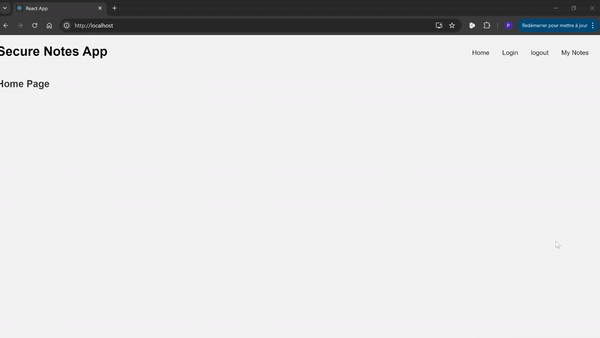

# React Notes

React note is a simple project made in two days to show our experience with react on the frontend and flask on the backend. The application is made deployement ready but has no purpose other than to serve as an example of our competence with these technologies.

## Demo
Here is an overview of what it looks like:

## Functionalities

The backend is written in flask with an sqlite3 database
- basic user functionalities (login, logout, register, delete)
- notes encryption, read, write, update
- sessions...
- basically a basic backend

The frontend is written with React
- Reactive components (states...)
- SPA (single page application. no page reloads... async requests)
- all functionalities of backend connected to frontend